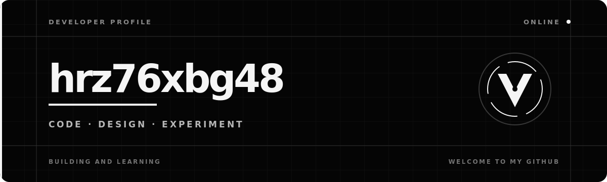
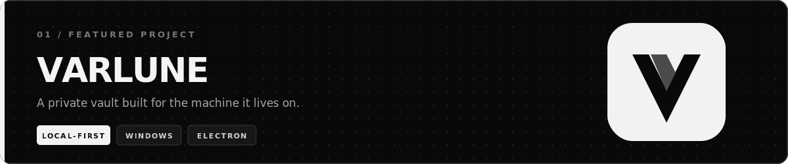

  

  <strong>I build focused desktop products that keep data close to the user.</strong> 
  Windows apps · local-first architecture · browser integrations · sharp interfaces

  
  
  

 

### `// CURRENT BUILD`

**Varlune** is an offline-first password manager for Windows. It combines an encrypted local vault, a bundled Chromium extension, TOTP codes, flexible themes, and a deliberately calm interface.

  <a href="https://github.com/hrz76xbg48-pixel/varlune"><strong>Explore the source →</strong></a>
  &nbsp;&nbsp;·&nbsp;&nbsp;
  <a href="https://github.com/hrz76xbg48-pixel/varlune/releases/latest"><strong>Latest release →</strong></a>

 

### `// TOOLBOX`

  
  
  
  
  
  
  

I care about the parts that are easy to overlook: readable typography, deliberate motion, clear system behavior, secure defaults, and packaging that works outside the developer's machine.

 

### `// OFF THE CLOCK`

Competitive games, sandbox worlds, high-fidelity graphics, DLSS experiments, horror aesthetics, and game tooling. I like software that feels precise, fast, and comfortable enough to disappear while you use it.

 

  BUILD SMALL · TEST HARD · SHIP THE REAL THING

